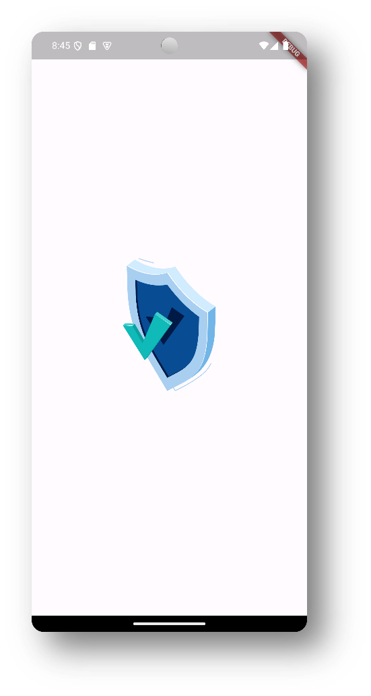
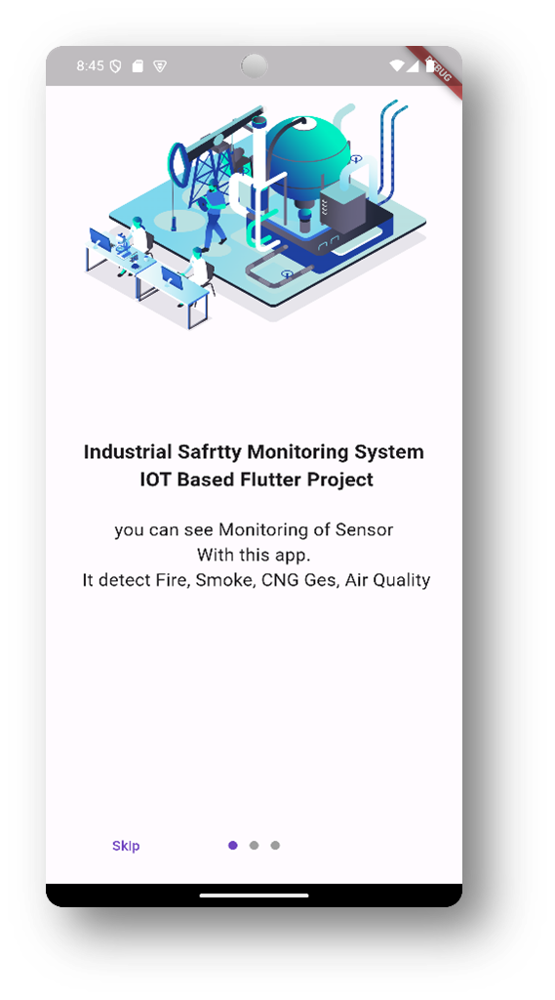
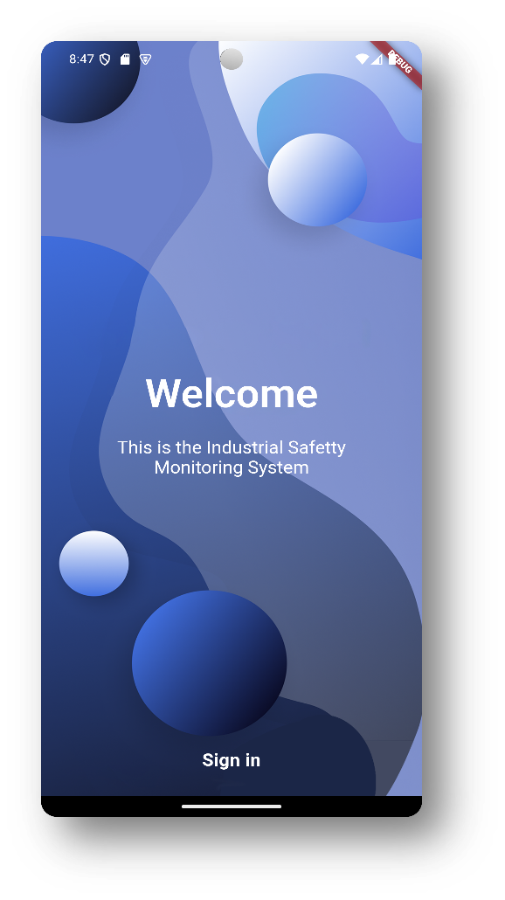
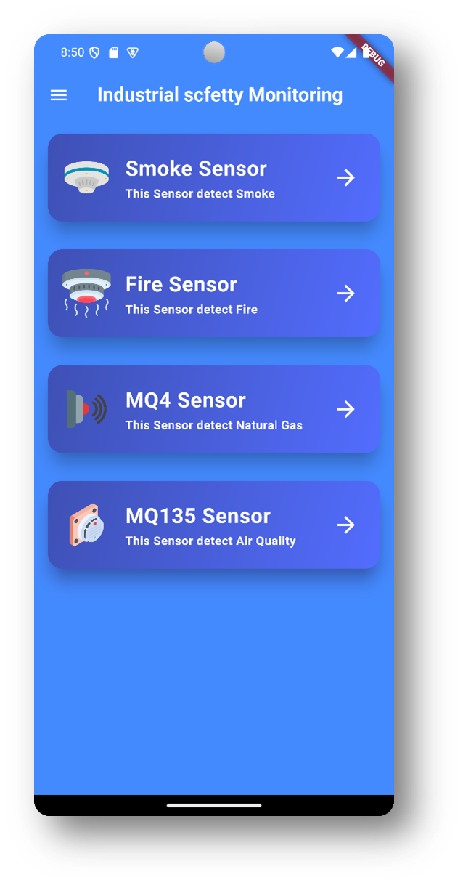
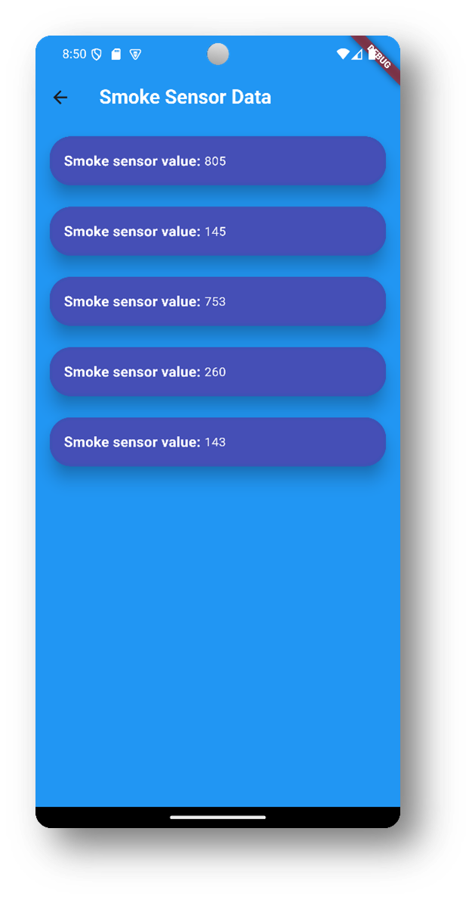
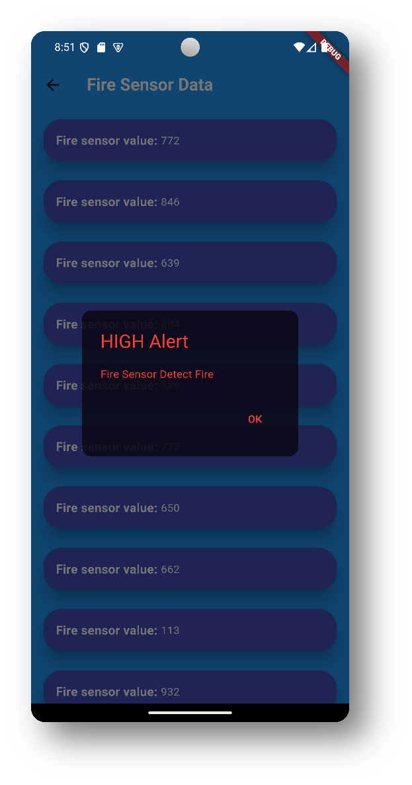

# 🏭 Flutter-Based Industrial Safety Monitoring System

<div align="center">


**A real-time IoT-based industrial safety monitoring mobile app built with Flutter, NodeMCU & MySQL.**

*Internship/Project — June–August 2024*

</div>

---

## 📱 Screenshots

| Splash Screen | Intro Screen | Welcome Screen |
|:---:|:---:|:---:|
|  |  |  |

| Home Screen | Sensor Data | 🚨 HIGH Alert |
|:---:|:---:|:---:|
|  |  |  |


---

## 📖 Project Overview

In industrial environments like manufacturing plants, chemical facilities, and oil refineries, hazardous conditions can arise without warning. Traditional safety methods rely on manual inspection, which is slow and insufficient for real-time threat detection.

This project addresses that gap with a **Flutter-Based Industrial Safety Monitoring System** — an IoT-powered mobile app that continuously monitors environmental hazards and sends instant alerts when danger thresholds are crossed.

---

## ✨ Features

- 🔴 **Real-Time Sensor Monitoring** — live data from Smoke, Fire, MQ4 (Gas), and MQ135 (Air Quality) sensors
- 🚨 **Instant HIGH Alerts** — automatic popup alerts when readings exceed safe thresholds
- 📱 **Cross-Platform App** — runs on both Android and iOS from a single Flutter codebase
- 🗄️ **Cloud Data Storage** — all sensor readings stored in a MySQL database via REST APIs
- 🔒 **User Authentication** — login/signup screen to restrict unauthorized access
- 📊 **Historical Data Access** — scroll through past sensor readings for trend analysis
- 🌐 **Remote Monitoring** — monitor industrial conditions from anywhere via mobile app
- 🔧 **Scalable Architecture** — easily add more sensors or features as needed

---

## 🛠️ Tech Stack

### Frontend
| Technology | Purpose |
|---|---|
| **Flutter** | Cross-platform mobile UI framework |
| **Dart** | Programming language for Flutter |

### Backend & Hardware
| Technology | Purpose |
|---|---|
| **NodeMCU (ESP8266)** | IoT microcontroller — collects & transmits sensor data via Wi-Fi |
| **MySQL** | Relational database for storing all sensor readings |
| **RESTful APIs** | Communication layer between Flutter app and backend server |
| **Arduino IDE** | Programming the NodeMCU microcontroller |

---

## 🔌 Sensors Used

| Sensor | Detects |
|---|---|
| 🔥 Fire Sensor | Flames and significant temperature increases |
| 💨 Smoke Sensor | Presence of smoke (fire precursor) |
| ⛽ MQ4 Gas Sensor | Methane (CH4) and natural gas leaks |
| 🌫️ MQ135 Air Quality Sensor | Ammonia, benzene, CO₂ and other harmful gases |

---

## 🗂️ Project Structure

```
industrial_safety_monitoring/
│
├── lib/
│   ├── main.dart
│   ├── homeScreen.dart
│   └── Sensor/
│       ├── smokeSensor.dart
│       ├── fireSensor.dart
│       ├── mq4Sensor.dart
│       └── mq135Sensor.dart
│
├── assets/
│   └── images/
│       ├── smoke-detector1.png
│       ├── fire-detector.png
│       ├── MQ4-sensor.png
│       └── MQ135-sensor.png
│
├── screenshots/
│   ├── splash.png
│   ├── home.png
│   ├── sensor_data.png
│   └── alert.png
│
└── README.md
```

---

## 🗃️ Database Schema

### `Smoke_tbl`
| Column | Type | Constraint |
|---|---|---|
| Sensor_id | INT | Primary Key, Auto Increment |
| Smoke_value | INT | — |
| Timestamp | TIMESTAMP | — |

### `Fire_tbl`
| Column | Type | Constraint |
|---|---|---|
| Sensor_id | INT | Primary Key, Auto Increment |
| Fire_value | INT | — |
| Timestamp | TIMESTAMP | — |

### `MQ4_tbl`
| Column | Type | Constraint |
|---|---|---|
| Sensor_id | INT | Primary Key, Auto Increment |
| MQ4_value | INT | — |
| Timestamp | TIMESTAMP | — |

### `MQ135_tbl`
| Column | Type | Constraint |
|---|---|---|
| Sensor_id | INT | Primary Key, Auto Increment |
| MQ135_value | INT | — |
| Timestamp | TIMESTAMP | — |

---

## ⚙️ Hardware Requirements

- NodeMCU (ESP8266 / ESP32)
- Smoke Sensor
- Fire Sensor
- MQ4 Gas Sensor
- MQ135 Air Quality Sensor
- Power Supply
- Wi-Fi Router
- Android or iOS Mobile Device

## 💻 Software Requirements

- [Flutter SDK](https://flutter.dev/docs/get-started/install)
- [Android Studio](https://developer.android.com/studio) or [VS Code](https://code.visualstudio.com/)
- [Arduino IDE](https://www.arduino.cc/en/software)
- MySQL Server
- Dart (bundled with Flutter)

---

## 🚀 Getting Started

### 1. Clone the Repository
```bash
git clone https://github.com/jainam258/Industrial_Safetty_Monitoring_system.git
cd Industrial_Safetty_Monitoring_system
```

### 2. Install Flutter Dependencies
```bash
flutter pub get
```

### 3. Set Up MySQL Database
- Create a MySQL database
- Run the schema to create the four sensor tables (`Smoke_tbl`, `Fire_tbl`, `MQ4_tbl`, `MQ135_tbl`)
- Set up a PHP/Node.js REST API to connect the database to the app

### 4. Configure NodeMCU
- Open Arduino IDE
- Flash the NodeMCU with your sensor reading code
- Update the Wi-Fi credentials and server IP in the NodeMCU sketch

### 5. Update API URL in Flutter App
- In each sensor Dart file, update the API endpoint to point to your backend server

### 6. Run the App
```bash
flutter run
```

---

## 👥 Users & Roles

| User | Capabilities |
|---|---|
| **Safety Officer / User** | View real-time sensor data, receive HIGH alerts, use the app |
| **Maintenance Technician** | Troubleshoot sensor issues, monitor connected/disconnected status |
| **Developer** | Fix bugs, develop new features, test system functionality |

---

## ✅ Testing Strategy

- **Unit Testing** — Individual widget and function validation using `flutter_test`
- **Integration Testing** — Navigation flow between screens and drawer functionality
- **Widget Testing** — UI rendering, color, layout across different screen sizes
- **System Testing** — End-to-end flow from sensor reading to app display
- **UI Testing** — Responsiveness in portrait and landscape orientations

---

## ⚡ Advantages & Limitations

### ✅ Advantages
- Real-time hazard monitoring with instant alerts
- Cross-platform (Android + iOS) from a single codebase
- Scalable — easily extend with more sensors
- Remote access from anywhere

### ⚠️ Limitations
- Requires stable Wi-Fi connection
- Sensors may need regular maintenance/calibration
- Initial hardware setup requires technical knowledge
- Data security depends on server configuration

---

## 🔮 Future Scope

- Add **temperature & humidity sensors** for broader monitoring
- Integrate with **SCADA / ERP** industrial management systems
- Implement **remote IoT device management** via the app
- Add **data visualization** with charts and graphs for trend analysis
- Enable **push notifications** for background alerts

---

## 👨‍💻 Author

**Jainam Shah**
- 🔗 [LinkedIn](https://linkedin.com/in/jainam-dev)
- 🐙 [GitHub](https://github.com/jainam258)


---

<div align="center">
⭐ If you found this project helpful, please give it a star!
</div>
